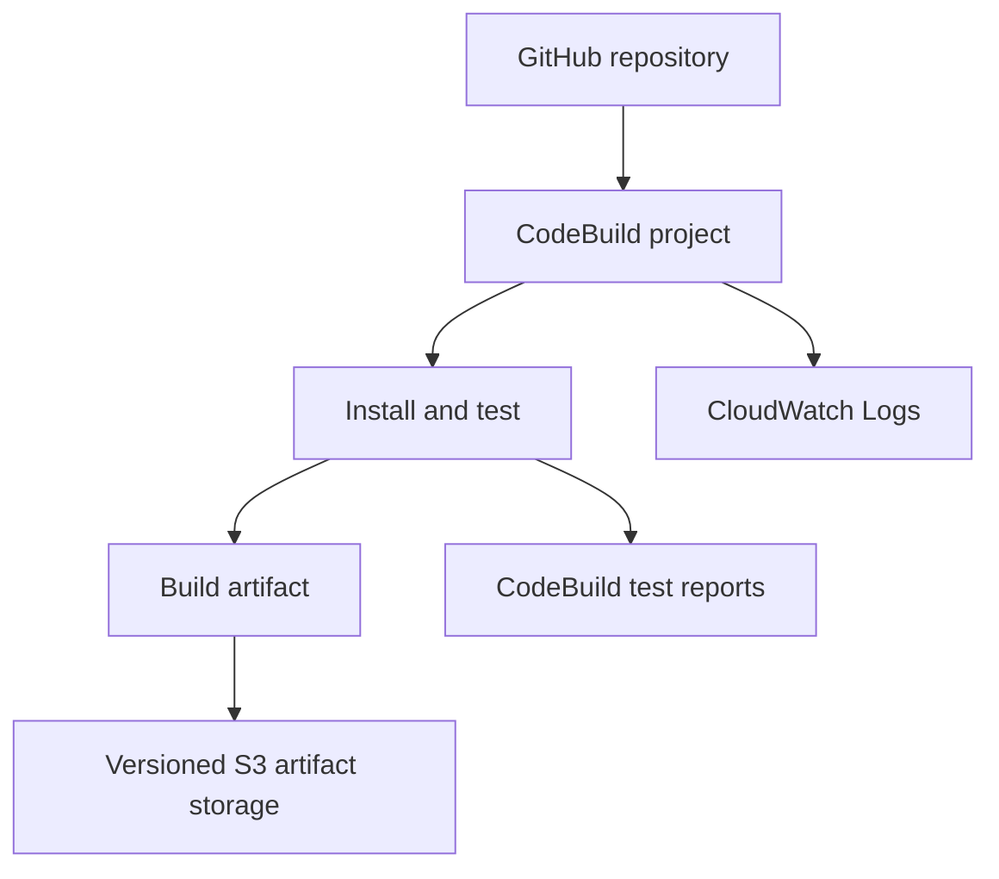

# AWS CodeBuild Training Lab: Build, Test, Quality Gates and CloudWatch Evidence

<p align="center">
  <a href="https://github.com/Donhadley22/aws-devops-demo/actions/workflows/ci.yml">
    
  </a>
  <a href="package.json">
    
  </a>
  <a href="buildspec.yml">
    
  </a>
  <a href="test/">
    
  </a>
</p>

<p align="center">
  <a href="#15-cloudwatch-logs-evidence">
    
  </a>
  <a href="infrastructure/codebuild-stack.yml">
    
  </a>
  <a href="Dockerfile">
    
  </a>
</p>

<p align="center">
  A hands-on training repository for source control, automated testing, AWS CodeBuild quality gates, CloudWatch Logs, infrastructure validation, and CI evidence collection.
</p>

## 1. Lab overview

This hands-on lab uses a small Node.js 22 HTTP service to demonstrate how source control, automated tests, AWS CodeBuild phases, test reports, CloudWatch Logs, and versioned S3 artifacts form a continuous-integration workflow.

The service exposes `GET /health` on port `3000` by default. Its two Jest tests verify the healthy response and the HTTP 404 behavior for an unknown path. AWS CodeBuild checks the JavaScript, runs those tests, validates a CloudFormation template, packages the application, records the source commit and build number, publishes JUnit results, and uploads a traceable ZIP artifact.

CodeBuild is a managed build service: it provisions an isolated build environment, downloads a selected source revision, runs the commands in [buildspec.yml](buildspec.yml), publishes logs and reports, uploads artifacts, and then releases the build environment. The GitHub repository remains the system of record because the application, tests, lock file, build instructions, infrastructure, and automation scripts are all versioned together.



| Item | Detail |
| --- | --- |
| Estimated completion time | 90–120 minutes, excluding account approvals or GitHub App authorization |
| Intended audience | Learners with basic Git, Node.js, npm, and AWS familiarity who are new to CodeBuild |
| Final outcome | One documented successful build, one deliberate `PRE_BUILD` test failure, one corrected successful build, and an evidence package linking commits, phases, logs, reports, and artifacts |

> **STOP AND CHECK**
>
> This lab can create billable AWS resources and an IAM role. Read every dry-run output before using `--apply`. Use a dedicated training account where possible.

## 2. Learning objectives

By the end of the lab, you will be able to:

- explain the repository layout and identify which file controls each quality gate;
- install dependencies deterministically and run the application, checks, tests, and build locally;
- describe every phase and output in [buildspec.yml](buildspec.yml);
- validate and deploy the optional CodeBuild infrastructure stack after review;
- configure or verify a GitHub-backed CodeBuild project using AWS CodeConnections;
- observe a successful build and locate its JUnit report, CloudWatch logs, resolved commit, and S3 artifact;
- introduce a safe, predictable test failure on a separate branch;
- identify `PRE_BUILD` as the failed phase and distinguish a Jest failure from IAM or infrastructure failure;
- restore the correct assertion and verify a successful follow-up build;
- apply least-privilege IAM and repository branch-protection principles;
- clean up resources without deleting shared infrastructure; and
- relate build evidence to DORA metrics and supporting engineering indicators.

## 3. Concepts covered

### Source control as the system of record

The repository contains the application, automated tests, exact dependency lock file, buildspec, infrastructure templates, workflow, and scripts. A build should be reproducible from a commit without undocumented console-only changes. Record the commit ID for every build so evidence can be traced back to immutable source.

### Pull requests and branch protection

A pull request makes a change reviewable before it reaches the protected branch. Branch protection can require human approval and successful automated checks. The included GitHub Actions workflow runs on pull requests targeting `main`; the CodeBuild template also creates pull-request and branch webhook filters.

### AWS CodeBuild and `buildspec.yml`

CodeBuild supplies the temporary build environment. [buildspec.yml](buildspec.yml) is the repository-owned YAML contract that selects Node.js 22 and defines install, pre-build, build, post-build, report, artifact, and cache behavior.

### Deterministic builds

`npm ci` installs exactly from [package-lock.json](package-lock.json) and refuses dependency-tree drift. Determinism reduces differences between a developer laptop and CodeBuild. Runtime determinism also matters: [package.json](package.json) requires Node.js `>=22 <23`, and CodeBuild explicitly selects Node.js 22.

### Tests and quality gates

The two Jest tests start the exported server on an ephemeral local port, make real HTTP requests, and then close it. They are integration-style HTTP tests around a small unit of application code. A quality gate is a mandatory check that stops the build on failure. This repository gates packaging on JavaScript syntax, Jest, and CloudFormation template validation.

### CloudWatch Logs and build artifacts

CloudWatch Logs stores timestamped build output in a log group and per-build log stream. Logs show phase markers, test output, errors, and timestamps. The S3 artifact is the packaged build output, not a replacement for source control. It includes the resolved commit ID and CodeBuild build number for traceability.

### IAM service roles and post-build evidence

CodeBuild assumes a service role to write logs and artifacts, publish reports, validate the application template, and retrieve GitHub connection credentials. Least privilege means granting only the actions and resource ARNs required by those tasks. Post-build evidence includes the build ID, resolved commit, phase statuses, log location, JUnit results, and artifact location.

### DORA metrics and supporting indicators

- **Deployment frequency:** how often changes reach production. This build-only lab does not deploy, so it provides a pipeline input rather than a production deployment count.
- **Lead time for changes:** elapsed time from a committed change to a successfully delivered change. In this lab, commit-to-successful-build time is a useful proxy, not full production lead time.
- **Change failure rate:** proportion of releases that cause failure. The deliberate build failure illustrates the calculation but is not a production release failure.
- **Time to restore service:** time from a failure to restored service. Here, failed-build-to-corrected-build time is a learning proxy.
- Supporting indicators include build duration, test pass rate, queue time, alarm noise, cost, and security findings.

> **SECURITY NOTE**
>
> A passing build demonstrates that declared checks passed for one revision. It does not prove that the application is secure, production-ready, or successfully deployed.

## 4. Repository layout

The source layout below reflects the files that currently exist. Generated `node_modules/`, `reports/`, and `dist/` directories are ignored and are not shown.

```text
aws-devops-demo/
├── .github/
│   └── workflows/
│       └── ci.yml
├── app/
│   └── server.js
├── infrastructure/
│   ├── application.yml
│   └── codebuild-stack.yml
├── scripts/
│   ├── build.js
│   ├── capture-evidence.sh
│   ├── cleanup-lab.sh
│   ├── deploy-codebuild-stack.sh
│   ├── set-test-result.js
│   ├── setup-local.sh
│   ├── start-build.sh
│   ├── validate-local.sh
│   └── wait-for-build.sh
├── test/
│   └── server.test.js
├── .env.example
├── .gitignore
├── Dockerfile
├── buildspec.yml
├── package.json
├── package-lock.json
└── README.md
```

| File | Purpose | Learner edit? | Lab phase | Evidence/output |
| --- | --- | --- | --- | --- |
| [app/server.js](app/server.js) | Dependency-free HTTP service with `/health`, 404 handling, `PORT`, and exported `createServer` | Normally no | 1 | Running health endpoint |
| [test/server.test.js](test/server.test.js) | Two Jest HTTP tests | Only through the deliberate failure helper | 1, 5, 6 | Console results and JUnit XML |
| [package.json](package.json) | Node 22 requirement, npm commands, Jest and `jest-junit` configuration | No during the core lab | 0, 1 | Declared commands and report path |
| [package-lock.json](package-lock.json) | Locked dependency graph for `npm ci` | Do not hand-edit | 1, CodeBuild `INSTALL` | Reproducible install |
| [buildspec.yml](buildspec.yml) | CodeBuild phases, runtime, reports, artifacts, and candidate npm cache path | Read and explain; edit only as an extension | 3–7 | Phase logs, report import, ZIP artifact |
| [scripts/build.js](scripts/build.js) | Recreates `dist/` and copies the app and dependency manifests | No | 1, `BUILD` | `dist/app/server.js`, manifests |
| [infrastructure/application.yml](infrastructure/application.yml) | Secure sample S3 template validated as a quality gate; CodeBuild does not deploy it | No | `PRE_BUILD` | Template-validation log line |
| [infrastructure/codebuild-stack.yml](infrastructure/codebuild-stack.yml) | Creates the lab bucket, log group, report group, IAM role, CodeBuild project, and webhooks | Review parameters; do not hard-code credentials | 2, 3, 9 | Stack outputs and resource ARNs |
| [scripts/setup-local.sh](scripts/setup-local.sh) | Verifies Node 22/npm, runs `npm ci`, prepares generated directories | No | 1 | Setup output |
| [scripts/validate-local.sh](scripts/validate-local.sh) | Runs syntax checks, tests, build, and `cfn-lint` when installed | No | 1, 2 | Local validation transcript |
| [scripts/deploy-codebuild-stack.sh](scripts/deploy-codebuild-stack.sh) | Shows account/stack/command; deploys only with `--apply` | Configure environment only | 2, 3 | Reviewed command and stack outputs |
| [scripts/start-build.sh](scripts/start-build.sh) | Prints start command; starts only with `--apply` | No | 4, 6 | Build ID |
| [scripts/wait-for-build.sh](scripts/wait-for-build.sh) | Polls one build with a finite timeout and prints phase results | Optional timeout values | 4–7 | Terminal status and phase table |
| [scripts/set-test-result.js](scripts/set-test-result.js) | Idempotently switches one health assertion between 200 and 500 | Run it; do not hand-edit unrelated tests | 5, 6 | Predictable failure/restoration |
| [scripts/capture-evidence.sh](scripts/capture-evidence.sh) | Prints build, commit, time, phase, log, and artifact evidence | Supply a build ID | 4–7 | Evidence table output |
| [scripts/cleanup-lab.sh](scripts/cleanup-lab.sh) | Verifies the lab tag, previews cleanup, empties the exact versioned bucket, and deletes the stack only after confirmation | Supply exact stack name | 9 | Stack deletion confirmation |
| [.github/workflows/ci.yml](.github/workflows/ci.yml) | Pull-request CI for `main`; no AWS deployment or credentials | Optional extension | 5, 6, 8 | GitHub check and failure artifact |
| [Dockerfile](Dockerfile) | Optional non-root Node 22 Alpine runtime image with health check | Optional extension only | 8 | Container build/scan result if used |
| [.env.example](.env.example) | Non-secret configuration placeholders | Copy locally and replace placeholders | 2–4 | Consistent script inputs |
| [.gitignore](.gitignore) | Excludes dependencies, generated output, `.env`, coverage, and logs | Usually no | All | Prevents accidental commits |

> **CHECKPOINT**
>
> You should be able to name the file responsible for each of these: application behavior, test behavior, dependency locking, CodeBuild phases, AWS resources, deliberate failure, evidence capture, and cleanup.

## 5. Prerequisites

### Required local tools

| Requirement | Verify | Expected |
| --- | --- | --- |
| Git | `git --version` | A supported Git version |
| Bash | `bash --version` | Git Bash, WSL, Linux, or macOS Bash |
| Node.js | `node --version` | Major version 22 |
| npm | `npm --version` | Installed with Node.js 22 |
| AWS CLI | `aws --version` | AWS CLI v2 recommended |
| Optional `cfn-lint` | `cfn-lint --version` | Enables local CloudFormation schema checks |
| Optional Docker | `docker --version` | Needed only for the container extension; CodeBuild does not build this image |

The repository enforces Node.js `>=22 <23`. Run the setup guard before installing dependencies:

```bash
bash scripts/setup-local.sh
```

### Required AWS and GitHub access

You need:

- an AWS account and selected Region;
- a CLI identity that can inspect the caller and, for the apply step, deploy CloudFormation with IAM resources;
- permission to create or use CodeBuild, CloudWatch Logs, S3, IAM, CodeBuild report groups, and CodeConnections-related resources;
- a GitHub repository containing this source and a branch that CodeBuild can read;
- permission to install or authorize the AWS GitHub App for that repository, or help from the repository/organization owner; and
- permission to configure branch protection for the optional governance phase.

Use placeholders until you know the real values:

```bash
export AWS_REGION="<AWS_REGION>"
export AWS_PROFILE="<AWS_PROFILE>"
export AWS_ACCOUNT_ID="<AWS_ACCOUNT_ID>"
export GITHUB_OWNER="<GITHUB_OWNER>"
export GITHUB_REPOSITORY="<GITHUB_REPOSITORY>"
export GITHUB_BRANCH="<GITHUB_BRANCH>"
export STACK_NAME="aws-devops-demo-codebuild"
export CODEBUILD_PROJECT_NAME="<CODEBUILD_PROJECT_NAME>"
export GITHUB_REPOSITORY_URL="https://github.com/${GITHUB_OWNER}/${GITHUB_REPOSITORY}.git"
export CODE_CONNECTION_ARN="<CODE_CONNECTION_ARN>"
export ARTIFACT_BUCKET="<ARTIFACT_BUCKET>"
export CODEBUILD_SERVICE_ROLE_ARN="<CODEBUILD_SERVICE_ROLE_ARN>"
```

Verify identity and repository context with read-only commands:

```bash
aws --profile "$AWS_PROFILE" --region "$AWS_REGION" sts get-caller-identity
git remote -v
git branch --show-current
git status --short
```

You may copy [.env.example](.env.example) to a local `.env` for non-secret script configuration, then export it into your shell:

```bash
cp .env.example .env
# Replace every placeholder, then:
set -a
source .env
set +a
git check-ignore .env
```

> **SECURITY NOTE**
>
> Never commit `.env`, AWS access keys, GitHub tokens, application secrets, or copied credentials. This lab uses an IAM role and CodeConnections rather than credentials in source. Store real application secrets in an appropriate secrets service, not plaintext CodeBuild variables or `buildspec.yml`.

## 6. Lab map

| Phase | Activity | Main resource | Evidence |
| --- | --- | --- | --- |
| 0 | Inspect the repository | Git | Repository tree, status, and confirmed npm commands |
| 1 | Run locally | Node.js/npm | Syntax, 2-test result, JUnit XML, and `dist/` |
| 2 | Prepare AWS resources | CloudFormation/IAM/S3/CloudWatch/CodeConnections | Account, stack inputs, names, ARNs, and validated template |
| 3 | Configure CodeBuild | CodeBuild/[buildspec.yml](buildspec.yml) | Project configuration and report group |
| 4 | Run a successful build | CodeBuild | Successful build ID, commit, logs, report, artifact |
| 5 | Introduce a failing test | Git/[test/server.test.js](test/server.test.js) | Failed commit, PR/check, build ID, `PRE_BUILD` failure |
| 6 | Fix and rebuild | Git/CodeBuild | Corrected commit and successful follow-up build |
| 7 | Capture evidence | CloudWatch/CodeBuild/GitHub/S3 | Completed evidence package |
| 8 | Add repository quality controls | GitHub | Branch protection and required checks |
| 9 | Clean up | CloudFormation/AWS/Git | Deleted lab stack/resources and temporary branch/files |

## 7. Phase 0 — Inspect the repository

Work from the repository root.

1. Confirm the branch and preserve existing work:

   ```bash
   git status --short
   git branch --show-current
   ```

2. List source files, including the hidden GitHub workflow:

   ```bash
   rg --files --hidden -g '!.git/**'
   ```

3. Inspect the declared Node version, npm commands, dependencies, and Jest report configuration:

   ```bash
   cat package.json
   node -p "require('./package.json').scripts"
   node -p "require('./package-lock.json').lockfileVersion"
   ```

4. Inspect application behavior and tests:

   ```bash
   cat app/server.js
   cat test/server.test.js
   ```

5. Inspect the build and infrastructure contracts:

   ```bash
   cat buildspec.yml
   cat infrastructure/application.yml
   cat infrastructure/codebuild-stack.yml
   ```

6. Inspect automation, container configuration, and pull-request CI:

   ```bash
   for file in scripts/*; do printf '\n--- %s ---\n' "$file"; sed -n '1,240p' "$file"; done
   cat Dockerfile
   cat .github/workflows/ci.yml
   ```

7. Confirm the actual npm commands:

   | Purpose | Command from `package.json` |
   | --- | --- |
   | Start | `npm start` |
   | JavaScript syntax checks | `npm run check` |
   | Tests | `npm test` |
   | Build | `npm run build` |

> **STOP AND CHECK**
>
> Do not proceed until your local files match the commands above and you understand that `infrastructure/application.yml` is validated but not deployed by CodeBuild.

## 8. Phase 1 — Run the application and tests locally

1. Use Node.js 22 and install exactly from the lock file:

   ```bash
   node --version
   bash scripts/setup-local.sh
   ```

   The script checks `node` and `npm`, requires Node major version 22, requires `package-lock.json`, runs `npm ci`, and creates `dist/` and `reports/`.

2. Run each repository command directly:

   ```bash
   npm run check
   npm test
   npm run build
   ```

3. Verify generated evidence:

   ```bash
   test -f reports/junit.xml
   find dist -maxdepth 3 -type f -print
   ```

   Expected build files are `dist/app/server.js`, `dist/package.json`, and `dist/package-lock.json`. CodeBuild later adds `dist/commit-id.txt` and `dist/build-number.txt`.

4. Start the service:

   ```bash
   npm start
   ```

   In a second terminal, query the health endpoint:

   ```bash
   curl -i http://127.0.0.1:3000/health
   curl -i http://127.0.0.1:3000/unknown
   ```

   Set a different port with `PORT=4000 npm start`. Stop the server with `Ctrl+C`.

> **EXPECTED RESULT**
>
> Jest reports 1 passing suite and 2 passing tests. `/health` returns HTTP 200 with `{"status":"healthy","service":"aws-devops-demo"}`; `/unknown` returns HTTP 404. The build prints `Application artifact created in the dist directory.`

A failing Jest run exits non-zero and names the failed assertion. For the deliberate exercise, change only the health-status expectation by running [scripts/set-test-result.js](scripts/set-test-result.js); do not damage application code. Restore it with the same helper in Phase 6.

> **CHECKPOINT**
>
> Save the passing test output and confirm `reports/junit.xml` exists before configuring AWS.

## 9. Phase 2 — Prepare AWS resources

The optional [infrastructure/codebuild-stack.yml](infrastructure/codebuild-stack.yml) creates the lab resources together. The GitHub CodeConnections connection must already exist and be authorized; the stack consumes its ARN but does not create it.

| Resource | Why required | Created/configured by | Required access | Verify | Cleanup |
| --- | --- | --- | --- | --- | --- |
| CodeConnections connection | Gives CodeBuild GitHub App credentials | One-time AWS console authorization | CodeBuild role: `GetConnection`, `GetConnectionToken` on the exact ARN | `aws codeconnections get-connection` returns `AVAILABLE` | Remove only if dedicated and no other workload uses it |
| CodeBuild project | Runs the repository buildspec | `codebuild-stack.yml` | Service role plus source access | `aws codebuild batch-get-projects` | Stack deletion |
| CodeBuild service role | Lets the project call dependent AWS services | `codebuild-stack.yml` | Logs, exact S3 path, report group, connection ARN, `ValidateTemplate` | Stack output and IAM console/CLI | Stack deletion; never remove a shared role |
| CloudWatch log group | Stores build logs | `codebuild-stack.yml` | `CreateLogStream`, `PutLogEvents` on that group | Stack output or Logs console | Stack deletion |
| Versioned S3 artifact bucket | Stores successful ZIP artifacts | `codebuild-stack.yml` | Bucket metadata reads and `PutObject` under `artifacts/*` | Stack output or S3 console | Cleanup script empties versions before stack deletion |
| CodeBuild report group | Imports `reports/junit.xml` | `codebuild-stack.yml` | Five report actions scoped to its ARN | Stack output or CodeBuild Reports | Stack deletion with reports |

### Validate locally without deploying

Run the repository validator:

```bash
bash scripts/validate-local.sh
```

It runs syntax checks, Jest, and the build. If `cfn-lint` is installed, it validates both templates locally. If not, it explains that schema validation was skipped and does not call AWS automatically.

With reviewed AWS credentials, you may run read-only template validation yourself:

```bash
aws --profile "$AWS_PROFILE" --region "$AWS_REGION" cloudformation validate-template \
  --template-body file://infrastructure/application.yml

aws --profile "$AWS_PROFILE" --region "$AWS_REGION" cloudformation validate-template \
  --template-body file://infrastructure/codebuild-stack.yml
```

These commands validate templates; they do not deploy resources.

### Prepare the GitHub connection

In the AWS console, open **Developer Tools settings → Connections** in the selected Region, create or select a GitHub connection, complete the GitHub App authorization, grant access to the lab repository, and wait for `AVAILABLE`. API-created connections remain pending until the console authorization is completed.

Verify it:

```bash
aws --profile "$AWS_PROFILE" --region "$AWS_REGION" codeconnections get-connection \
  --connection-arn "$CODE_CONNECTION_ARN" \
  --query 'Connection.{Arn:ConnectionArn,Status:ConnectionStatus,Provider:ProviderType}' \
  --output table
```

### Preview and optionally deploy the lab stack

Load the values from `.env` or export them directly, then preview:

```bash
bash scripts/deploy-codebuild-stack.sh
```

This default mode makes read-only STS calls to display the account and caller, then prints the exact deployment command. After independent review, the learner may explicitly deploy:

```bash
bash scripts/deploy-codebuild-stack.sh --apply
```

The apply command uses `CAPABILITY_IAM` because the stack creates a service role. It does not deploy `infrastructure/application.yml`.

After deployment, record outputs:

```bash
aws --profile "$AWS_PROFILE" --region "$AWS_REGION" cloudformation describe-stacks \
  --stack-name "$STACK_NAME" --query 'Stacks[0].Outputs' --output table
```

Recommended naming pattern:

- stack: `aws-devops-demo-codebuild`;
- project: `aws-devops-demo-build`;
- log group: `/aws/codebuild/<project-name>`;
- report group: `<project-name>-unit-tests`;
- artifact bucket: let CloudFormation generate the globally unique name.

> **EVIDENCE TO CAPTURE**
>
> Record the AWS account, Region, stack name, CodeBuild project name, connection ARN, artifact bucket, log group, report group ARN, and service-role ARN. Redact the account ID if course policy requires it.

## 10. Phase 3 — Configure CodeBuild

If you deployed [infrastructure/codebuild-stack.yml](infrastructure/codebuild-stack.yml), the following configuration is already defined as code. Verify it rather than creating a duplicate project manually.

1. **Source:** `GITHUB` with `GITHUB_REPOSITORY_URL`, authenticated by the exact `CODE_CONNECTION_ARN` using `CODECONNECTIONS`.
2. **Revision:** `GITHUB_BRANCH` is the default source version; Git clone depth is `1`.
3. **Webhooks:** one filter starts builds for pushes whose `HEAD_REF` matches the configured branch. A second starts builds for pull requests created, updated, or reopened where `BASE_REF` matches that branch.
4. **Environment:** `LINUX_CONTAINER`, `BUILD_GENERAL1_SMALL`, AWS-managed image `aws/codebuild/standard:7.0` by default, and CodeBuild-managed image credentials.
5. **Runtime:** `buildspec.yml` requests `nodejs: 22`. Runtime availability depends on the selected image. Check the AWS managed-runtime table before changing `BuildImage` or the runtime version.
6. **Privileges:** `PrivilegedMode: false`; this project does not run Docker-in-Docker.
7. **Service role:** the stack-created role with scoped log, artifact, report, validation, and connection permissions.
8. **Buildspec:** `buildspec.yml` at the repository root.
9. **Logs:** enabled for `/aws/codebuild/${ProjectName}` with a stream prefix matching the project name and configurable retention.
10. **Artifacts:** S3 ZIP packaging under `artifacts/`; buildspec semantic naming overrides `placeholder.zip`.
11. **Reports:** `TEST_REPORT_GROUP_ARN` is a non-secret plaintext environment variable containing the stack-created report-group ARN.
12. **Timeouts:** 20-minute build timeout and 30-minute queued timeout.
13. **Visibility:** private.
14. **Cache:** the project sets `Cache: NO_CACHE`. Although `buildspec.yml` declares `/root/.npm/**/*`, that candidate path is not active unless the project cache configuration is changed deliberately.

> **STOP AND CHECK**
>
> Confirm that the selected managed image supports Node.js 22, the CodeConnections status is `AVAILABLE`, the project points to the intended repository/branch, and the service-role ARN is the stack output—not an unrelated role.

## 11. `buildspec.yml` walkthrough

The buildspec uses version `0.2` and the Bash shell. Version 0.2 lets commands in a phase share shell state.

| Section | Actual behavior | Why it matters |
| --- | --- | --- |
| `version: 0.2` | Uses current buildspec command semantics | Commands run predictably within a phase |
| `env.shell` | Selects Bash | The commands use Bash variable syntax and `printf` |
| `phases.install` | Selects Node.js 22, prints versions, runs `npm ci` | Installs exactly from the lock file before any gate |
| `phases.pre_build` | Runs `npm run check`, `npm test`, and `aws cloudformation validate-template` on `infrastructure/application.yml` | Stops packaging when syntax, tests, or infrastructure validation fails |
| `phases.build` | Runs `npm run build`, writes commit/build metadata | Produces traceable output under `dist/` |
| `phases.post_build` | Prints a UTC completion timestamp and artifact-upload notice | Gives a clear terminal phase marker |
| `reports` | Imports `reports/junit.xml` into `$TEST_REPORT_GROUP_ARN` as JUnit XML | Makes pass/fail/test duration visible in CodeBuild Reports |
| `artifacts` | Uploads `dist/**/*` using `builds/<build-number>/aws-devops-demo-<commit>.zip` | Prevents ambiguous overwrites and ties output to a revision |
| `cache` | Declares `/root/.npm/**/*` | Candidate path only; the current project disables cache with `NO_CACHE` |

Each phase sets `on-failure: ABORT`. A non-zero exit from `npm ci`, syntax checking, Jest, CloudFormation validation, or the build stops the quality pipeline. Tests run before packaging so broken revisions do not produce a successful application artifact.

`npm ci` is preferred over `npm install` in CI because it consumes the committed lock file without updating dependency intent. `CODEBUILD_RESOLVED_SOURCE_VERSION` and `CODEBUILD_BUILD_NUMBER` are written into the artifact, while CodeBuild also exposes them in build metadata and logs.

Do not store passwords, tokens, access keys, or application secrets in the buildspec. Use IAM roles and an appropriate AWS secrets service when a future build genuinely needs secrets.

> **EXPECTED RESULT**
>
> A successful run shows `INSTALL`, `PRE_BUILD`, `BUILD`, and `POST_BUILD` as succeeded, followed by report and artifact processing. CloudWatch Logs contain the bracketed phase messages from the buildspec.

## 12. Phase 4 — Run the first successful build

These are learner actions; they are not run automatically by this repository.

1. Confirm the baseline revision is committed and available in the configured GitHub branch:

   ```bash
   git status --short
   git branch --show-current
   git rev-parse HEAD
   git ls-remote --heads origin "$GITHUB_BRANCH"
   ```

2. Preview the start command:

   ```bash
   bash scripts/start-build.sh
   ```

3. Start the build after review:

   ```bash
   bash scripts/start-build.sh --apply
   ```

4. Copy the returned build ID and monitor it:

   ```bash
   export BUILD_ID="<CODEBUILD_PROJECT_NAME:BUILD_UUID>"
   bash scripts/wait-for-build.sh "$BUILD_ID"
   ```

   The default timeout is 1,800 seconds with 10-second polling. Optional overrides are `--timeout-seconds` and `--poll-seconds`.

5. In the CodeBuild console, open the project and build. Observe `INSTALL`, `PRE_BUILD`, `BUILD`, and `POST_BUILD`, then open **Build logs** and **Reports**.

6. Capture the machine-readable summary:

   ```bash
   bash scripts/capture-evidence.sh "$BUILD_ID"
   ```

7. Confirm artifact objects using the bucket from the stack outputs:

   ```bash
   aws --profile "$AWS_PROFILE" --region "$AWS_REGION" s3api list-objects-v2 \
     --bucket "$ARTIFACT_BUCKET" --prefix artifacts/ --output table
   ```

8. Record the resolved source version and compare it with the intended commit:

   ```bash
   git rev-parse HEAD
   aws --profile "$AWS_PROFILE" --region "$AWS_REGION" codebuild batch-get-builds \
     --ids "$BUILD_ID" --query 'builds[0].resolvedSourceVersion' --output text
   ```

### Successful-build evidence record

| Field | Value |
| --- | --- |
| Build ID |  |
| Commit ID |  |
| Branch |  |
| Start time |  |
| End time |  |
| Build status |  |
| Failed phase, if any | None expected |
| CloudWatch log group |  |
| CloudWatch log stream |  |
| Artifact location |  |
| Test result summary | 2 passed, 0 failed expected |

> **EVIDENCE TO CAPTURE**
>
> Retain the evidence-script output, phase view, JUnit report summary, relevant CloudWatch log lines, resolved commit, and artifact location. Do not submit credentials or unredacted sensitive data.

## 13. Phase 5 — Deliberately fail a quality gate

The goal is to demonstrate that automated tests block a bad revision. Do not modify production behavior or introduce a vulnerability.

1. Start from the configured branch and create a separate exercise branch:

   ```bash
   git switch "$GITHUB_BRANCH"
   git status --short
   git switch -c lab/deliberate-test-failure
   ```

2. Change only the health-response expectation from 200 to 500:

   ```bash
   node scripts/set-test-result.js fail
   git diff -- test/server.test.js
   ```

3. Run the test and confirm the predictable failure:

   ```bash
   npm test
   ```

> **EXPECTED RESULT**
>
> The health test fails with `Expected: 500` and `Received: 200`; the unknown-path test still passes. This non-zero result is intentional.

4. Commit only the test change and push the exercise branch:

   ```bash
   git add test/server.test.js
   git commit -m "test: demonstrate CodeBuild quality gate"
   git push -u origin lab/deliberate-test-failure
   ```

5. Open a pull request from `lab/deliberate-test-failure` to the configured `GITHUB_BRANCH`. The template's `PULL_REQUEST_CREATED` filter should trigger CodeBuild; the GitHub Actions workflow also runs when the base branch is `main`.

6. If the webhook is intentionally unavailable, start the exact failing commit manually rather than building the project's default branch:

   ```bash
   export FAILED_COMMIT_ID="$(git rev-parse HEAD)"
   aws --profile "$AWS_PROFILE" --region "$AWS_REGION" codebuild start-build \
     --project-name "$CODEBUILD_PROJECT_NAME" \
     --source-version "$FAILED_COMMIT_ID"
   ```

7. Observe the failed build. Jest runs in `PRE_BUILD`, so the deliberate assertion failure must fail that phase. Record the failed build ID and resolved commit:

   ```bash
   bash scripts/capture-evidence.sh "<FAILED_BUILD_ID>"
   ```

> **CHECKPOINT**
>
> Confirm that the resolved source version equals the failing commit and that the log shows the Jest assertion failure. An IAM or artifact error does not count as the deliberate quality-gate failure.

## 14. Phase 6 — Fix the failure and rebuild

1. Restore the HTTP 200 expectation with the idempotent helper:

   ```bash
   node scripts/set-test-result.js pass
   git diff -- test/server.test.js
   ```

2. Run the complete local checks:

   ```bash
   npm run check
   npm test
   npm run build
   ```

3. Commit and push the fix on the same pull-request branch:

   ```bash
   git add test/server.test.js
   git commit -m "test: restore passing health expectation"
   git push
   ```

4. The `PULL_REQUEST_UPDATED` webhook should start a new build. If it does not, verify the webhook and source settings before starting the exact corrected commit manually.

5. Monitor and capture the corrected build:

   ```bash
   bash scripts/wait-for-build.sh "<CORRECTED_BUILD_ID>"
   bash scripts/capture-evidence.sh "<CORRECTED_BUILD_ID>"
   ```

6. Compare the two records:

   | Run | Build ID | Commit ID | Result | Failed/passed phase |
   | --- | --- | --- | --- | --- |
   | Deliberate failure |  |  | Failed | `PRE_BUILD` |
   | Corrected test |  |  | Succeeded | All phases |

> **CHECKPOINT**
>
> Retain both build histories. The corrected build must reference a different commit and succeed without erasing the failed run that demonstrates the quality gate.

## 15. CloudWatch Logs evidence

The stack output `BuildLogGroupName` identifies the group. A log group collects streams with common retention and access settings; each build has a stream containing ordered log events.

Locate the log details with the evidence script or directly:

```bash
bash scripts/capture-evidence.sh "$BUILD_ID"

aws --profile "$AWS_PROFILE" --region "$AWS_REGION" logs describe-log-streams \
  --log-group-name "/aws/codebuild/${CODEBUILD_PROJECT_NAME}" \
  --order-by LastEventTime --descending --max-items 10
```

Look for:

- `[install]`, `[pre_build]`, `[build]`, and `[post_build]` markers;
- Node.js and npm versions;
- Jest pass/fail output and assertion text;
- the infrastructure-validation marker and any AWS error;
- UTC timestamps and phase durations;
- the build ID in the console/stream context;
- `resolvedSourceVersion` from the build record; and
- the artifact location after a successful run.

### Distinguish test failures from IAM failures

If Jest prints a failed assertion and exits non-zero, the application-test quality gate failed. If both Jest tests pass but `aws cloudformation validate-template` returns `AccessDenied`, the test gate passed and the infrastructure-validation call failed because the active CodeBuild service role lacks permission or the project is using the wrong role.

This repository really does validate `infrastructure/application.yml` in `PRE_BUILD`, and [infrastructure/codebuild-stack.yml](infrastructure/codebuild-stack.yml) already includes `cloudformation:ValidateTemplate`.

Minimal example to adapt to the actual CodeBuild service role:

```json
{
  "Version": "2012-10-17",
  "Statement": [
    {
      "Sid": "ValidateInfrastructureTemplates",
      "Effect": "Allow",
      "Action": [
        "cloudformation:ValidateTemplate"
      ],
      "Resource": "*"
    }
  ]
}
```

Required investigation sequence:

1. Identify the active role from the CodeBuild project or `CodeBuildServiceRoleArn` stack output.
2. Confirm the exact denied action and phase in CloudWatch Logs.
3. Compare the deployed role with the role declared in `codebuild-stack.yml`.
4. Add only the missing permission through the infrastructure source of truth, or correct the project to use the intended role.
5. Re-run the same commit.
6. Classify and record the cause as test, IAM, artifact, source, runtime, YAML, or another configuration issue.

> **TROUBLESHOOTING**
>
> An `AccessDenied` after two passing Jest tests is not the required deliberate test failure. Capture it separately as an IAM configuration failure.

## 16. Troubleshooting guide

| Symptom | Likely cause | Verification | Corrective action |
| --- | --- | --- | --- |
| `npm ci` fails | Lock-file mismatch, wrong Node version, or registry access | Inspect `package-lock.json`, `node --version`, and install output | Use Node 22; restore matching manifests; do not replace `npm ci` with an updating install in CI |
| Tests fail locally | Application/test regression or deliberate 500 expectation | Run `npm test`; inspect `test/server.test.js` | Fix code/test or run `node scripts/set-test-result.js pass` |
| Tests pass but CodeBuild fails | IAM, YAML, artifact, source, or environment problem | Find the first failed phase and command in logs | Correct that configuration; do not rewrite passing tests |
| `cloudformation:ValidateTemplate` denied | Active CodeBuild role lacks the action or wrong role is attached | Find `AccessDenied` in `PRE_BUILD`; inspect project role | Use the stack role or add only `cloudformation:ValidateTemplate` through IaC |
| Runtime unsupported | Selected image does not provide Node.js 22 | Read install-phase error and AWS runtime table | Use a managed image that supports Node.js 22 or change runtime deliberately |
| CloudWatch Logs missing | Logging disabled or role lacks stream/write permissions | Inspect `LogsConfig` and role policy | Enable the configured group and grant its exact ARN |
| Artifact missing | Build failed before upload, wrong file path, or S3 denial | Inspect phase status, `dist/`, artifact settings, and upload logs | Fix the first failure or exact `artifacts/*` permission/path |
| GitHub webhook does not trigger | Connection pending, app lacks repository/webhook access, or branch filter mismatch | Check connection status, GitHub App access, and filter refs | Authorize connection and align repository/branch/filter settings |
| Duplicate builds appear | Both GitHub Actions and CodeBuild respond to the PR, or duplicate webhooks exist | Inspect GitHub checks and CodeBuild initiator/history | Keep intentional checks; remove duplicate webhook paths |
| Build cannot access S3 | Role lacks exact bucket/path permission or bucket is in an incompatible setup | Read artifact-upload error and compare bucket output | Grant only required metadata and `PutObject` access to the lab bucket path |
| YAML parse error | Indentation, quoting, or unsupported key | Run `cfn-lint`/local YAML validation and inspect failing line | Correct YAML structure; do not deploy until validation passes |
| Build uses wrong commit | Default branch or manual source version differs from intended revision | Compare Git SHA with `resolvedSourceVersion` | Start the exact commit or correct branch/webhook settings |
| Report missing/incomplete | JUnit file absent, report ARN wrong, or report permissions missing | Check `reports/junit.xml`, `TEST_REPORT_GROUP_ARN`, and upload phase | Restore `jest-junit`, correct the ARN, and scope required report actions |
| Cache has no effect | Project cache is `NO_CACHE` | Inspect `CodeBuildProject.Cache` in the stack | Leave disabled for the lab or deliberately configure a supported cache with encryption |

## 17. Evidence package

Submit or retain the following as required by your course:

- [ ] Repository commit ID for the working baseline
- [ ] Successful local test output showing 2 passing tests
- [ ] One failed CodeBuild build
- [ ] Failed build ID
- [ ] Failed commit ID
- [ ] `PRE_BUILD` recorded as the deliberate failed phase
- [ ] CloudWatch log group and stream
- [ ] Relevant Jest error lines and timestamps
- [ ] Corrected commit ID
- [ ] Successful follow-up build ID
- [ ] Successful follow-up test/report output
- [ ] S3 artifact location
- [ ] CodeBuild JUnit report summary
- [ ] GitHub check or pull-request result
- [ ] Screenshots or exported logs, if required by the course
- [ ] Written classification of any unrelated IAM or configuration failure

Use the repository helper for each build:

```bash
bash scripts/capture-evidence.sh "<BUILD_ID>"
```

> **EVIDENCE TO CAPTURE**
>
> Redact access keys, tokens, secrets, private repository URLs if required, sensitive application output, and account IDs according to course policy. A connection ARN and role ARN are identifiers, not passwords, but they may still reveal account and Region information and should be redacted when sharing publicly.

## 18. Quality gates and branch protection

### Automated in this repository

- GitHub Actions runs `npm ci`, `npm run check`, `npm test`, and `npm run build` for pull requests targeting `main` with `contents: read` permission.
- CodeBuild runs syntax checks, Jest, and CloudFormation validation before packaging.
- Jest creates JUnit XML; CodeBuild imports it into a report group.
- The build artifact contains commit/build metadata.
- The Dockerfile runs as the non-root `node` user and has a health check, although the current CI paths do not build or scan it.

### Recommended repository controls

1. Require pull requests for the protected branch.
2. Require at least one approving review and resolved conversations.
3. Require the observed GitHub Actions check, normally `CI / test`.
4. After the first webhook build, identify the exact CodeBuild check/status name and require it if the integration reports status as intended.
5. Block direct pushes and force pushes to the protected branch, including administrators where governance requires it.
6. Enable dependency and secret scanning appropriate to the repository plan.
7. Add infrastructure policy/compliance validation beyond syntax where required.
8. If the Dockerfile becomes a release artifact, add image vulnerability scanning and provenance.
9. Before production, add post-deployment smoke tests and alarm/health checks; this lab does not deploy the application.

Automated checks answer whether declared technical rules passed. Human approvals provide governance, risk judgment, and accountability that a test cannot supply.

> **SECURITY NOTE**
>
> Choose required checks after they have run at least once so GitHub displays their exact names. Avoid two jobs or workflows with the same check name because required-check selection becomes ambiguous.

## 19. DORA metrics exercise

Use the evidence from the failed and corrected runs to discuss—not overclaim—the following metrics.

| Metric | Simple calculation | Evidence source | Lab limitation |
| --- | --- | --- | --- |
| Deployment frequency | Production deployments / time period | A future deployment system | This repository builds but does not deploy |
| Lead time for changes | Successful delivery time − first commit time | Git commit time, successful CodeBuild end time | Build completion is only a proxy for delivery |
| Change failure rate | Failed or rolled-back releases / total releases | Release/deployment records | A failed CI build is not a failed production release |
| Time to restore service | Restored service time − incident start time | Incident and deployment records | Failed-build-to-fixed-build time is a training proxy |
| Build duration | Build end time − build start time | `capture-evidence.sh`/CodeBuild | Does not include review or deployment |
| Test pass rate | Passing test cases / total executed test cases | JUnit report | Only two tests exist in this demo |
| Queue time | Build start time − submission time | CodeBuild build metadata | Requires initiator/event timestamp |
| Alarm noise | Non-actionable alarms / total alarms | CloudWatch alarm history | No alarms are created by this lab |
| Cost per environment | Allocated build + log + storage cost / environment | AWS billing tags/cost tools | Shared/free-tier effects require interpretation |
| Security findings | Open findings by severity and age | Future dependency/container/IaC scanners | Those scanners are recommended, not currently configured |

Suggested exercise:

1. Record the failing commit time, failed build start/end, corrected commit time, and successful build end.
2. Calculate deliberate build failure rate as `failed lab builds / total lab builds`, labeling it as a CI indicator rather than DORA change failure rate.
3. Calculate time from the failed build to the corrected successful build as a restoration-practice indicator.
4. Identify which additional deployment and incident data would be required for true DORA reporting.

## 20. Security and cost guidance

- Never commit AWS credentials, GitHub tokens, `.env`, or application secrets.
- Prefer short-lived identity federation and IAM roles over long-lived access keys.
- Apply least privilege to both the learner identity and the CodeBuild service role.
- Keep CodeConnections access limited to the intended connection and repository installation.
- Block S3 public access unless a reviewed use case explicitly requires public content. This lab blocks it and denies insecure transport.
- Keep artifact encryption and versioning enabled; understand that versions increase retained storage.
- Limit CloudWatch log retention appropriately. The template defaults to 14 days.
- Do not print secrets in build commands or logs.
- Keep CodeBuild privileged mode disabled when Docker-in-Docker is not required.
- Stop or delete unused projects, buckets, log groups, report groups, roles, and stacks.
- Check for ongoing charges after cleanup, including retained S3 versions or resources created outside the stack.
- Use a dedicated lab account and an AWS Budget alert when possible.

> **SECURITY NOTE**
>
> `cloudformation:ValidateTemplate` uses `Resource: "*"` because template validation is not scoped to a created stack resource. Other permissions in the lab role are scoped to the generated log group, bucket path, report group, or connection ARN.

## 21. Cleanup

> **CLEANUP**
>
> Never delete a shared production project, role, connection, bucket, log group, or stack. Verify the account, Region, exact stack name, `Lab=aws-devops-demo` tag, and stack outputs first.

1. Close or merge the exercise pull request according to course policy. Disable or delete any manually created duplicate webhook. The stack-managed webhook is removed with the CodeBuild project during stack deletion.

2. Preview the repository cleanup script:

   ```bash
   bash scripts/cleanup-lab.sh --stack-name "$STACK_NAME"
   ```

   The script uses read-only stack calls to verify the exact stack has `Lab=aws-devops-demo` and resolves its exact artifact bucket. Without `--apply`, it deletes nothing.

3. After checking the scope, apply and type the exact stack name when prompted:

   ```bash
   bash scripts/cleanup-lab.sh --stack-name "$STACK_NAME" --apply
   ```

   The script deletes versions and delete markers only from the resolved lab artifact bucket, deletes the stack, and waits for completion. The stack removes the CodeBuild project/webhook, report group/reports, log group, IAM role/policy, bucket policy, and emptied artifact bucket.

4. If resources were created manually outside the stack, remove them individually only after proving they are dedicated to this lab:

   - delete/disable the CodeBuild webhook integration;
   - delete the CodeBuild project;
   - empty and delete the temporary artifact bucket, including versions;
   - delete the lab log group and report group;
   - remove the temporary IAM role/policy only if no other workload uses it; and
   - remove the CodeConnections connection only if it is dedicated and unshared.

5. Verify the stack is absent and check the AWS console for leftover billable resources.

6. Remove the local exercise branch only after switching away from it and preserving required evidence:

   ```bash
   git switch "$GITHUB_BRANCH"
   git branch -d lab/deliberate-test-failure
   git push origin --delete lab/deliberate-test-failure
   ```

7. Remove local generated configuration/output if no longer needed:

   ```bash
   rm -f -- ./.env
   rm -rf -- ./dist ./reports
   ```

## 22. Learner reflection

1. Which CodeBuild phase failed when the test was deliberately broken, and why?
2. How did the failed commit differ from the corrected commit?
3. How did CloudWatch Logs distinguish the Jest failure from an IAM failure?
4. Which permissions did the CodeBuild service role actually use?
5. Why does `cloudformation:ValidateTemplate` appear in the role policy?
6. What evidence connects an S3 artifact to its Git commit and CodeBuild run?
7. Which current check would you require before merging to the protected branch?
8. What dependency, infrastructure, container, smoke-test, or alarm checks would you add before production?
9. Which DORA metric can this build-only lab measure most reliably, and which require deployment data?
10. What evidence would an auditor or course assessor need, and what should be redacted?
11. Why is the declared npm cache path inactive in the current project?
12. What risks would arise if the lab connection, role, or bucket were shared with production?

## 23. Instructor or assessment notes

This optional 100-point rubric can be adapted to course requirements.

| Category | Points | Evidence of mastery |
| --- | ---: | --- |
| Repository understanding | 10 | Correctly maps files, commands, phases, and generated outputs |
| Local reproducibility | 15 | Uses Node 22, `npm ci`, passes 2 tests, creates JUnit and `dist/` |
| CodeBuild configuration | 15 | Correct source, image/runtime, role, logs, reports, artifacts, and webhooks |
| Test-failure demonstration | 15 | Separate branch, predictable 500 expectation, failed `PRE_BUILD`, exact commit/build IDs |
| CloudWatch evidence | 15 | Correct group/stream, timestamps, phase markers, error lines, and correlation |
| IAM reasoning | 10 | Distinguishes test/IAM failures and proposes minimum permission through IaC |
| Security and cleanup | 10 | No secrets committed; safe scoped cleanup and cost verification |
| Written observations | 10 | Clear comparison of failed/successful runs, DORA limitations, and improvement ideas |

Automatic failure conditions may include deploying unreviewed production resources, exposing credentials, omitting the corrected passing build, or claiming an IAM failure as the deliberate test failure.

## 24. References

Repository references:

- [Application](app/server.js)
- [Tests](test/server.test.js)
- [Package scripts and Jest configuration](package.json)
- [CodeBuild buildspec](buildspec.yml)
- [Application validation template](infrastructure/application.yml)
- [CodeBuild infrastructure stack](infrastructure/codebuild-stack.yml)
- [GitHub Actions workflow](.github/workflows/ci.yml)
- [Environment example](.env.example)

Official AWS documentation:

- [AWS CodeBuild User Guide](https://docs.aws.amazon.com/codebuild/latest/userguide/welcome.html)
- [Build specification reference](https://docs.aws.amazon.com/codebuild/latest/userguide/build-spec-ref.html)
- [Available runtimes for AWS CodeBuild](https://docs.aws.amazon.com/codebuild/latest/userguide/available-runtimes.html)
- [Create a build project](https://docs.aws.amazon.com/codebuild/latest/userguide/create-project.html)
- [GitHub App connections for CodeBuild](https://docs.aws.amazon.com/codebuild/latest/userguide/connections-github-app.html)
- [CodeBuild report groups](https://docs.aws.amazon.com/codebuild/latest/userguide/test-report-group.html)
- [CodeBuild test report permissions](https://docs.aws.amazon.com/codebuild/latest/userguide/test-permissions.html)
- [Working with CloudWatch log groups and streams](https://docs.aws.amazon.com/AmazonCloudWatch/latest/logs/Working-with-log-groups-and-streams.html)
- [CloudFormation `ValidateTemplate` API](https://docs.aws.amazon.com/AWSCloudFormation/latest/APIReference/API_ValidateTemplate.html)
- [IAM policies and permissions](https://docs.aws.amazon.com/IAM/latest/UserGuide/access_policies.html)
- [IAM security best practices](https://docs.aws.amazon.com/IAM/latest/UserGuide/best-practices.html)

Official GitHub documentation:

- [Managing protected branches](https://docs.github.com/en/repositories/configuring-branches-and-merges-in-your-repository/managing-protected-branches)
- [About protected branches and required status checks](https://docs.github.com/en/repositories/configuring-branches-and-merges-in-your-repository/managing-protected-branches/about-protected-branches)
- [Workflow syntax for GitHub Actions](https://docs.github.com/en/actions/reference/workflows-and-actions/workflow-syntax)
